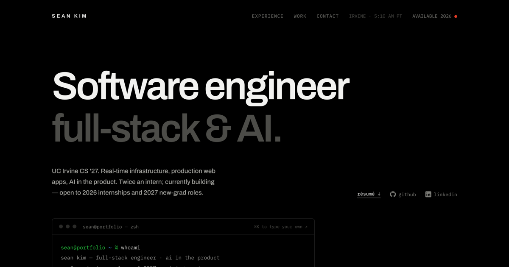

# Sean Kim — Portfolio

**Live:** [sean-kim05.github.io](https://sean-kim05.github.io/)

My personal portfolio — a hand-built, **single-file site** (no framework, no build step) showcasing my experience, projects, and skills as a Computer Science student at **UC Irvine (Class of 2027)**.



---

## ✨ The site itself

Built from scratch in vanilla **HTML / CSS / JS** — one `index.html`, zero dependencies, zero build step.

- Animated constellation canvas background + smooth cursor-follow glow
- Self-typing terminal intro (`whoami` → `cat profile.json`)
- Infinite tech-stack marquee
- Reveal-on-scroll animations, live scroll-progress bar, and active-section nav highlighting
- Dark editorial design system (DM Serif Display · DM Mono · Instrument Sans)
- Fully responsive, with a **reduced-motion** path and decorative elements marked `aria-hidden`

---

## 🚀 Featured projects

| Project | What it is | Stack | Links |
|---|---|---|---|
| **CollabCode** | Real-time collaborative code editor — live cursors, follow mode, multi-file workspace. **50 concurrent clients/room @ 17 ms p95 sync latency**; three-layer Redis / PostgreSQL / SQLite persistence; Claude API across 4 modes (generate · fix · explain · improve) with sandboxed execution | React, TypeScript, Monaco, Flask-SocketIO, Redis, PostgreSQL, Claude API | [Live](https://collaborative-code-editor-livid.vercel.app) · [Code](https://github.com/sean-kim05/collaborative-code-editor) |
| **Briefly** | AI standup tool on Cloudflare Workers — custom SSE streaming of Llama 3.3 tokens, a Durable Objects backend (personal + team-room namespaces), and weekly AI summaries via a chained second LLM call | Cloudflare Workers, Durable Objects, Workers AI, Llama 3.3, JavaScript | [Live](https://cf-ai-standup.skim8705.workers.dev) · [Code](https://github.com/sean-kim05/cf_ai_standup) |
| **DSA Visualizer** | Interactive visualizer covering **12 algorithms** across pathfinding (Dijkstra, A\*, BFS, DFS), sorting, BSTs, heaps, and graphs, plus a Claude AI tutor that streams context-aware explanations via SSE | React, Vite, Flask, Anthropic SDK, Python, CI/CD | [Live](https://sean-kim05.github.io/DSAVisualizer/) · [Code](https://github.com/sean-kim05/DSAVisualizer) |

---

## 💼 Experience

- **MIADVG** — *Software Engineer Intern* (Jun – Sep 2025): shipped & maintained 3 React/TypeScript client apps to **10,000+ combined users**; built Express/Node REST endpoints across PostgreSQL & MySQL; automated CI/CD on AWS EC2 (2–3 releases/week).
- **CALIT2, UC Irvine** — *Software Developer Intern* (Jan – May 2025): built a Flask computer-vision system streaming 5+ GPU-accelerated cameras to a React dashboard at **100–200 ms latency**; fine-tuned YOLO with PyTorch transfer learning (**+8 mAP**).
- **UC Irvine** — *Undergraduate Research Assistant* (Jan – Jun 2024): built Python pipelines and evaluated the fine-tuned GPT-3.5 model behind **ZotGPT**, now serving **36,000+ students**.

---

## 🧰 Tech stack

- **Languages:** Python · JavaScript · TypeScript · Java · C / C++ · SQL · HTML/CSS
- **Frameworks & Libraries:** React · Node.js · Express · Flask · Tailwind CSS · PyTorch · NumPy · Pandas
- **AI / ML:** LLM integration · fine-tuning · transfer learning · computer vision · Anthropic SDK
- **Cloud & Tools:** AWS (EC2) · Cloudflare Workers (AI) · Docker · GitHub Actions · CI/CD · PostgreSQL · MySQL · Redis · SQLite · Vite · Git

---

## 🛠️ Run locally

Static site — no build required:

```bash
git clone https://github.com/sean-kim05/sean-kim05.github.io.git
cd sean-kim05.github.io

# open index.html directly, or serve it:
python -m http.server 8000   # → http://localhost:8000
```

## 🚢 Deploy

Hosted on **GitHub Pages**. Pushing to `main` auto-deploys to [sean-kim05.github.io](https://sean-kim05.github.io/).

---

## 📬 Contact

- **Email:** skim8705@gmail.com
- **LinkedIn:** [/in/seankim08](https://www.linkedin.com/in/seankim08)
- **GitHub:** [/sean-kim05](https://github.com/sean-kim05)
- **Resume:** [Sean_Kim_Resume.pdf](Sean_Kim_Resume.pdf)
