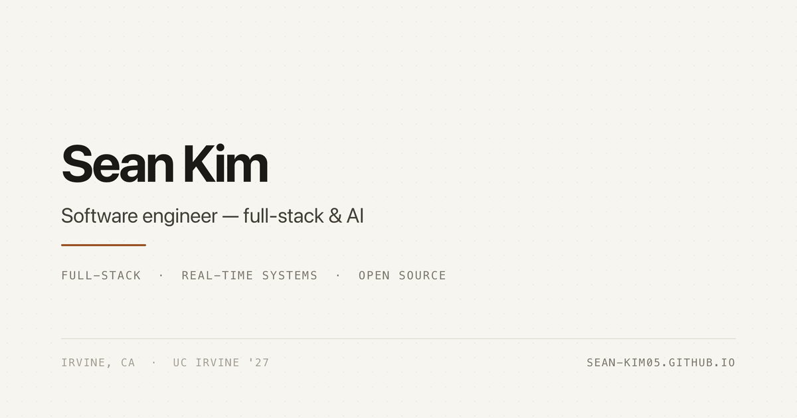

# Sean Kim — Portfolio

**Live:** [sean-kim05.github.io](https://sean-kim05.github.io/)

My personal portfolio — a hand-built static site (no framework, no build step) covering my experience, projects, and skills as a Computer Science student at **UC Irvine (Class of 2027)**.



---

## ✨ The site itself

Four pages of vanilla **HTML and CSS** — `index.html`, `experience.html`, `projects.html`, `opensource.html` — sharing a single `style.css`. No framework, no dependencies, no build step. Warm paper theme on a system font stack, with a burnt-orange accent.

The only JavaScript is a 3.5KB async [GoatCounter](https://www.goatcounter.com/) tag for privacy-friendly analytics — no cookies, no consent banner, nothing that blocks rendering.

- **Sticky left rail** carrying identity, nav, contact links, and the resume download; content scrolls independently on the right
- **Paper-grain background** — a fine dot lattice under a radial mask, static rather than animated
- **Benchmarked project write-ups** — the numbers on the projects page come from benchmark scripts in each repo, and each one states what it was measured against
- Collapses to a single column at 900px, and honors `prefers-reduced-motion`

A `.nojekyll` file tells GitHub Pages to skip Jekyll and publish the files as-is, which keeps deploys near-instant.

URLs are extensionless — `/projects`, not `/projects.html`. GitHub Pages resolves those to the matching `.html` file automatically, so all internal links, canonicals, and the sitemap use the clean form. The `.html` URLs still work for anyone who has one bookmarked. Note that `python3 -m http.server` does *not* do this resolution, so clean URLs 404 locally; open the `.html` files directly when previewing offline.

---

## 🚀 Featured work

| Project | What it is | Stack | Links |
|---|---|---|---|
| **CollabCode** | Real-time collaborative code editor — live cursors, follow mode, multi-file rooms. Three-layer persistence (memory → Redis → Postgres) so a server restart doesn't cost anyone their room. **50 clients/room at <17 ms p95 sync**; Claude assists inline across generate · fix · explain · improve | React 18, TypeScript, Vite, Monaco, Socket.IO, Flask-SocketIO, Postgres, Redis, Claude | [Live](https://collaborative-code-editor-livid.vercel.app) · [Code](https://github.com/sean-kim05/collaborative-code-editor) |
| **Ada** *(in progress)* | Personal agent cockpit — give it a goal and watch the trace panel stream every step (plan → tool call → observe). Claude orchestrates; a local Qwen-14B on Ollama absorbs the cheap subtasks. Runs locally in Docker; nothing deployed yet | FastAPI, Pydantic AI, React, TypeScript, Postgres, Redis, Qdrant, Claude, Ollama | [Code](https://github.com/sean-kim05/ada) |
| **Docent** | Agentic research assistant — decomposes a question into sub-questions, routes each to your docs or the live web, retrieves and reranks, then streams one grounded answer with inline citations. Hand-rolled RAG, no LangChain/LlamaIndex | Next.js, TypeScript, Tailwind, FastAPI, Pinecone, Voyage, Tavily, Claude | [Live](https://ask-docent.vercel.app) · [Code](https://github.com/sean-kim05/agentic-research-assistant) |

---

## 💼 Experience

- **MIADVG** — *Software Engineer Intern* (Jun – Sep 2025, Irvine, CA): built and shipped 3 production React/**Next.js** apps in TypeScript with Tailwind serving **50,000+ combined users**; developed 10+ Express endpoints over PostgreSQL and MySQL, cutting API latency **67%** (300 ms → 100 ms) by collapsing 100+ per-item queries into a single JOIN; integrated Stripe, Twilio, and Google OAuth 2.0; automated AWS EC2 deploys via GitHub Actions + Vitest (2–3 releases/week).
- **CALIT2, UC Irvine** — *Software Developer Intern* (Jan – May 2025, Costa Mesa, CA): built a Flask-SocketIO backend streaming 5+ camera feeds to a React dashboard over WebSockets at **100–200 ms** latency; cut duplicate alerts **40%** with a Redis TTL cache and RabbitMQ priority queues; fine-tuned YOLO with PyTorch transfer learning (**+8 mAP**).
- **UC Irvine** — *Undergraduate Research Assistant* (Jan – Jun 2024, Irvine, CA): built Python ETL pipelines (BeautifulSoup, PyPDF2, Pandas) normalizing thousands of UCI PDF/HTML docs into training-ready text for iGPT, and evaluated fine-tuned GPT-3.5 on UCI-specific queries — early-stage work that later became **ZotGPT**.

---

## 🌱 Open source

**14 patches merged** into libraries I use — mostly correctness fixes for edge cases found while building something else and fixed upstream instead of worked around. Full list with links: [/opensource](https://sean-kim05.github.io/opensource).

| Project | Merged | What it is |
|---|---|---|
| [three.js](https://github.com/mrdoob/three.js) | 3 | JavaScript 3D library (114k ★) |
| [Strix](https://github.com/usestrix/strix) | 2 | Open-source AI penetration testing tool (51k ★) |
| [Pydantic AI](https://github.com/pydantic/pydantic-ai) | 3 | AI agent framework (19k ★) |
| [redis-py](https://github.com/redis/redis-py) | 1 | Official Redis Python client (13.6k ★) |
| [Prometheus Python client](https://github.com/prometheus/client_python) | 5 | Official instrumentation library (4.3k ★) |

More in review at Anthropic's Python SDK, Ollama, and ComfyUI.

---

## 🧰 Tech stack

- **Languages:** Python · TypeScript · JavaScript · Java · C++ · SQL · HTML/CSS
- **Frameworks:** React · Next.js · Node/Express · Flask · FastAPI · Tailwind · WebSockets
- **Data:** PostgreSQL · MySQL · Redis · Pinecone · Qdrant · Vector search
- **Infra:** Git · Linux · Docker · AWS EC2 · Cloudflare Workers · RabbitMQ · GitHub Actions · pytest · Vitest
- **AI / ML:** RAG · Agentic pipelines · Fine-tuning · PyTorch · YOLO · Anthropic SDK

---

## 🛠️ Run locally

Static site — no build required:

```bash
git clone https://github.com/sean-kim05/sean-kim05.github.io.git
cd sean-kim05.github.io

# open index.html directly, or serve it:
python3 -m http.server 8000   # → http://localhost:8000
```

The one dev dependency is [`sharp`](https://sharp.pixelplumbing.com/), used offline to convert project screenshots from PNG to WebP. It is never needed to run or deploy the site — only to regenerate `assets/*.webp`:

```bash
npm install
node -e "require('sharp')('assets/collabcode.png').webp({quality:82}).toFile('assets/collabcode.webp')"
```

## 🚢 Deploy

Hosted on **GitHub Pages** — the single source of truth. Pushing to `main` auto-deploys to [sean-kim05.github.io](https://sean-kim05.github.io/); every page declares a `rel="canonical"` pointing there.

---

## 📬 Contact

- **Email:** skim8705@gmail.com
- **LinkedIn:** [/in/seankim08](https://linkedin.com/in/seankim08)
- **GitHub:** [/sean-kim05](https://github.com/sean-kim05)
- **Resume:** [assets/Sean_Kim_Resume.pdf](assets/Sean_Kim_Resume.pdf)
